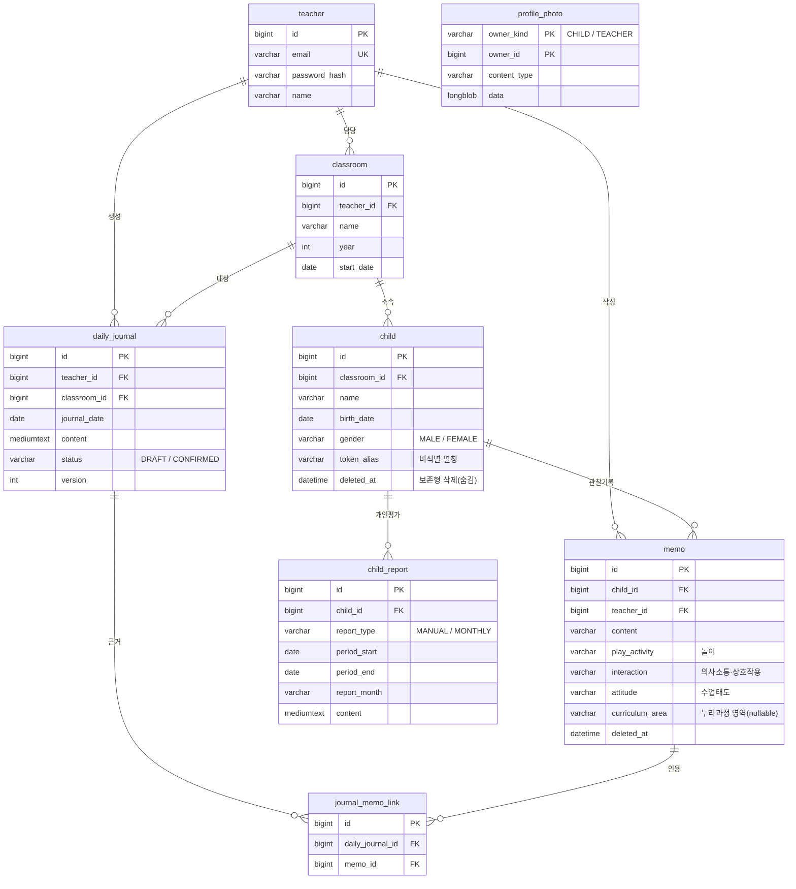

# 온도 (ONDO)

> **온전히 도와드리겠습니다.** — 선생님 곁의 따뜻한 온도.

유치원 교사 업무 도구 — 짧은 **메모**를 남기면 아이별로 기록이 쌓이고, **AI**가 누리과정 기반 하루 **일지**·**개인 관찰평가**를 만들어 주는 서비스.

설계 산출물은 [`_bmad-output/planning-artifacts/`](_bmad-output/planning-artifacts/)
(PRD · 아키텍처 · 에픽/스토리)와 [`docs/specs/`](docs/specs/)(API·데이터모델·에러코드·AI 연동 명세)를 정본으로 따른다.

## 저장소 구조

```
ondo/
├── backend/                 # Spring Boot 4 + Java 25 (Gradle) REST API
│   └── src/main/java/com/ondo/
│       ├── auth/            # 회원가입 · 로그인 · JWT
│       ├── classroom/       # 담당 반 · 새 반 생성
│       ├── child/           # 아이 등록·수정 · 보존형 삭제(숨김)·복원
│       ├── memo/            # 메모 기록 · 타임라인 · 누리과정 영역
│       ├── journal/         # AI 하루 일지(생성·검토·확정·재분석)
│       ├── report/          # 개인 관찰평가(수동 + 월말 자동 스케줄러)
│       ├── photo/           # 프로필 이미지(아이·교사)
│       ├── ai/              # AiClient 추상화 + OpenAiClient · 비식별화 · 프롬프트/검증
│       ├── common/          # 공통 에러·예외·시간(KST)·동시성 가드·BaseEntity
│       └── config/          # Security · JPA · AI · Scheduling 설정
├── frontend/                # Vue 3 + Vite SPA (반응형: 데스크톱/모바일)
│   ├── src/                 # views · components · stores · lib · router
│   └── mockups/             # Claude Design 디자인 정본(목업)
├── docs/specs/              # 구현 명세 + AI 연동 · 정합 가이드
└── _bmad-output/            # PRD · 아키텍처 · 에픽/스토리 · 회고 (BMad 산출물)
```

## 기술 스택

| 영역    | 선택                                              |
|---------|---------------------------------------------------|
| 백엔드  | Java 25 LTS · Spring Boot 4.0.x · Gradle 9.5      |
| DB      | MySQL 8.4 · Spring Data JPA · Flyway (스키마 정본, V3) |
| 인증    | Spring Security (stateless) · JWT (jjwt) · BCrypt  |
| AI      | **OpenAI** Chat Completions · structured outputs(strict) · `max_completion_tokens` · 기본 모델 `gpt-5.4-mini` · RestClient(raw HTTP) |
| 프론트  | Vue 3 (Composition API, Pinia 미사용) · Vite 8 · 반응형(사이드바↔하단탭) · 무의존 이미지 크로퍼 |
| 테스트  | JUnit 5 · Testcontainers(MySQL) · 스텁 AiClient    |
| 인프라  | Docker · docker-compose (app + mysql) · 프로덕션 nginx 정적 서빙(Epic 5) |

## 개발 실행

> 포트: 백엔드 **8090**, 프론트 dev **5273** (다른 프로젝트와 충돌을 피하려 8080/5173에서 변경).
> 하루 경계는 **KST(Asia/Seoul)** 기준(일지·평가 기간 계산 일관).

### 백엔드

```bash
cd backend
cp .env.example .env          # 환경변수 채우기 (.env 는 커밋 금지)
./gradlew build               # 빌드 + 테스트 (Docker 필요 — Testcontainers)
./gradlew bootRun             # 실행 (MySQL 필요) → http://localhost:8090
```

- 기동에는 MySQL 이 필요하다(`db/migration` 의 Flyway 마이그레이션 적용, `ddl-auto=validate`).
- 헬스체크: `GET /actuator/health`
- AI 호출은 `AI_API_KEY`(OpenAI) 가 있어야 동작한다. 미설정 시 일반 화면은 정상, AI 일지·평가 생성만 실패한다.

### Docker 로 한 번에 (app + mysql)

```bash
docker compose up -d --build           # app + mysql 기동, Flyway 자동 적용
curl localhost:8090/actuator/health    # {"status":"UP"}
```

- 호스트 포트 충돌 시 `APP_PORT=8091 docker compose up -d` 로 변경 가능.
- dev 프로파일은 시드 교사(`teacher@ondo.dev` / `password1234`)와 햇살반·아이 6명을 생성해 바로 둘러볼 수 있다. (prod 프로파일은 시드를 만들지 않음 — 회원가입으로 시작)

### 프론트엔드

```bash
cd frontend
npm install
npm run dev                   # http://localhost:5273 (→ /api 는 :8090 으로 프록시)
npm run build                 # 프로덕션 빌드(dist)
```

- **반응형**: 창 폭 **900px** 이상은 데스크톱(좌측 사이드바) 레이아웃, 미만은 모바일(하단 탭) 레이아웃으로 자동 전환된다.
- 디자인은 `frontend/mockups/`(Claude Design)를 정본으로 따른다.

## 기능 (구현 완료)

- **회원가입·로그인** — 이메일·비밀번호(BCrypt), 가입 즉시 자동 로그인(JWT).
- **반** — 담당 반 선택 · **새 반 추가**(온보딩형: 반 이름·학년도·아이 입력).
- **아이** — 등록·수정 · 보존형 삭제(명단에서 숨김) · **숨긴 아이 보기/복원**.
- **메모** — 빠른 메모(놀이·상호작용·태도) · 아이별 타임라인(누리과정 영역 필터·인라인 수정).
- **AI 하루 일지** — 오늘 메모 묶음 → 비식별화→AI→복원→검증 → 누리 5영역 초안 생성 · 검토·수정·확정 · 재분석.
- **개인 관찰평가** — 아이별 수동 생성(기간 자동) · 목록·상세 · **월말 자동 스케줄러**(@Scheduled, 멱등).
- **프로필 사진** — 아이·교사. 임의 크기 첨부 → 브라우저에서 **1:1 크롭**(512px) → 업로드, 아바타 표시.
- 모든 화면이 데스크톱/모바일 두 레이아웃을 가진다.

## 실행 화면

**데스크톱 (사이드바 레이아웃)**

| 로그인 | 홈 | 아이 목록 | 아이 타임라인 |
|:---:|:---:|:---:|:---:|
|  |  |  |  |

**모바일 (하단 탭 레이아웃)**

| 홈 | 아이 목록 | 빠른 메모 | 아이 타임라인 |
|:---:|:---:|:---:|:---:|
|  |  |  |  |

> 캡처는 dev 시드 데이터(햇살반) 기준. 재생성: `cd frontend && node scripts/shoot.mjs` (dev 서버 + 백엔드 기동 상태에서 실행).

## 데이터 모델 (ERD)

Flyway 마이그레이션(`backend/src/main/resources/db/migration`)이 스키마 정본. 자세한 정의는 [`docs/specs/data-model-spec.md`](docs/specs/data-model-spec.md).



| 테이블 | 설명 | 핵심 제약 |
|--------|------|-----------|
| `teacher` | 교사 계정 | `email` 유니크 |
| `classroom` | 담당 반(학년도 단위) | `(teacher_id, name, year)` 유니크 |
| `child` | 원아 | `(classroom_id, token_alias)` 유니크 · 보존형 삭제(`deleted_at`) |
| `memo` | 관찰 메모(놀이·상호작용·태도) | 누리과정 영역은 일지 분석 시 자동 분류(nullable) · 소프트 삭제 |
| `daily_journal` | 하루 일지(AI 생성) | `(teacher_id, classroom_id, journal_date)` 유니크 · 재분석 `version` |
| `journal_memo_link` | 일지 ↔ 근거 메모 (N:M) | `(daily_journal_id, memo_id)` 유니크 |
| `child_report` | 개인 관찰평가(기간) | `(child_id, report_month)` 유니크(월말 자동 멱등) |
| `profile_photo` | 프로필 이미지(아이·교사) | `(owner_kind, owner_id)` 복합 PK |

## 현재 상태

| 단계 | 내용 | 상태 |
|------|------|------|
| Epic 1 | 골격 · 인증(JWT) · 반 선택 · 아이 등록·관리 · 워킹 스켈레톤 Docker | ✅ 완료 |
| Epic 1+ | 회원가입(self sign-up) · 새 반 추가 · 아이 숨김/복원 · 프로필 사진 | ✅ 완료 |
| Epic 2 | 메모 기록 · 타임라인 · 누리과정 영역 분류 | ✅ 완료 |
| Epic 3 | AI 하루 일지 (비식별화 → 분석 → 검증 · 재분석) | ✅ 완료 |
| Epic 4 | 개인 관찰평가 (수동 + 월말 자동 스케줄러) | ✅ 완료 |
| 프론트 | Vue+Vite 전 화면 + 반응형(데스크톱/모바일) + 아바타 사진 | ✅ 완료 |
| Epic 5 | 실배포 (prod 프로파일 · nginx 정적 서빙 · `deploy.sh`) | 🔜 진행 중 |

전체 **125개 테스트 통과**(JUnit5 · Testcontainers). AI 일지·개인평가는 실제 OpenAI(`gpt-5.4-mini`)로 end-to-end 검증됨.
