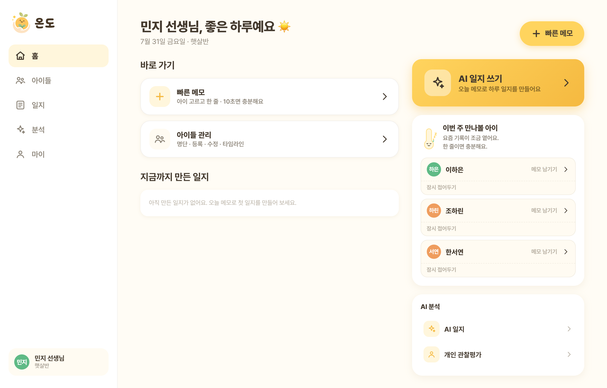
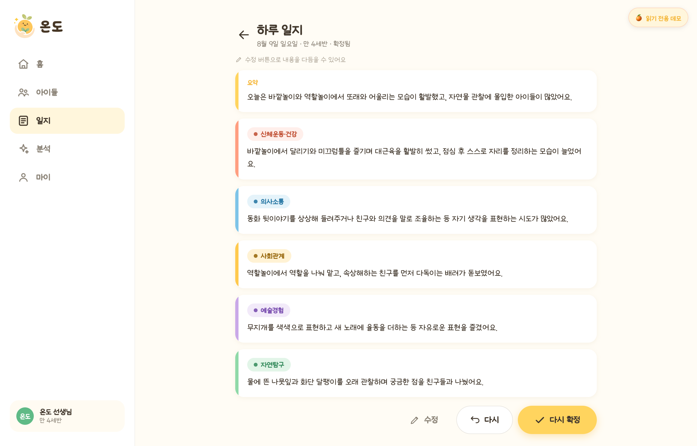
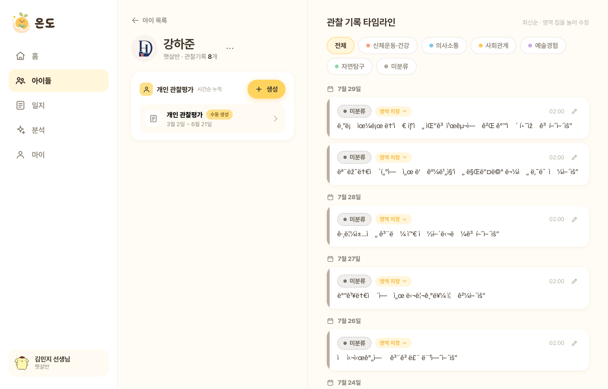
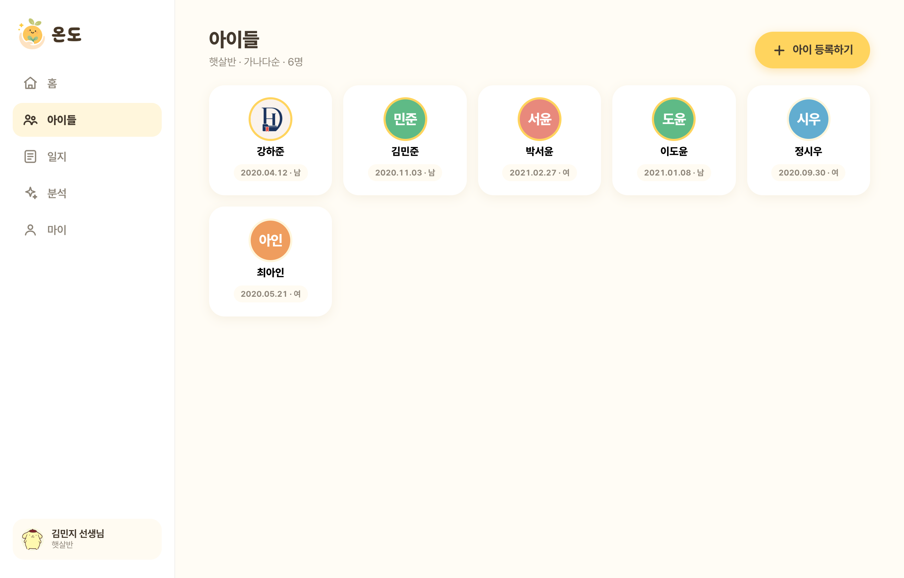
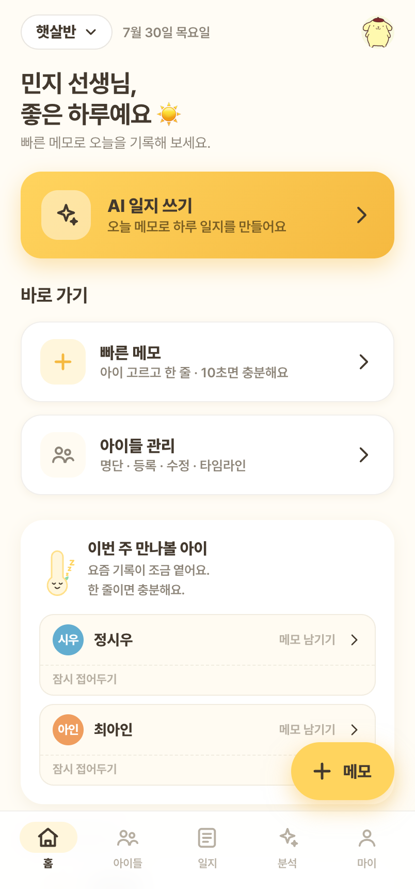
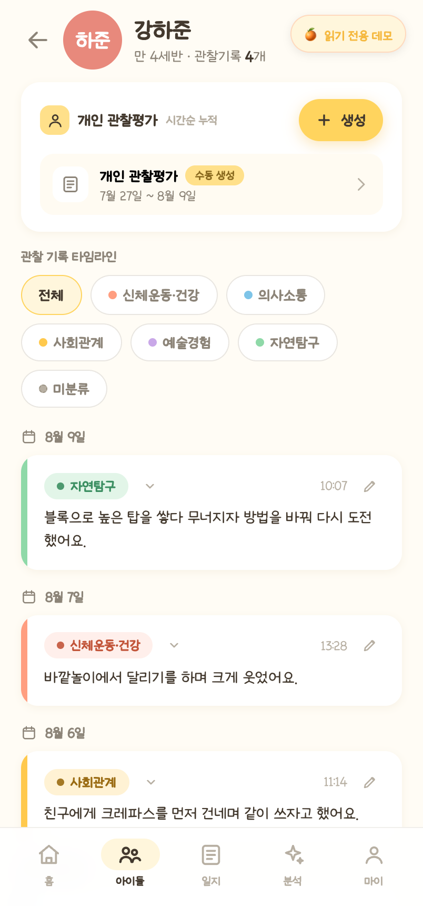
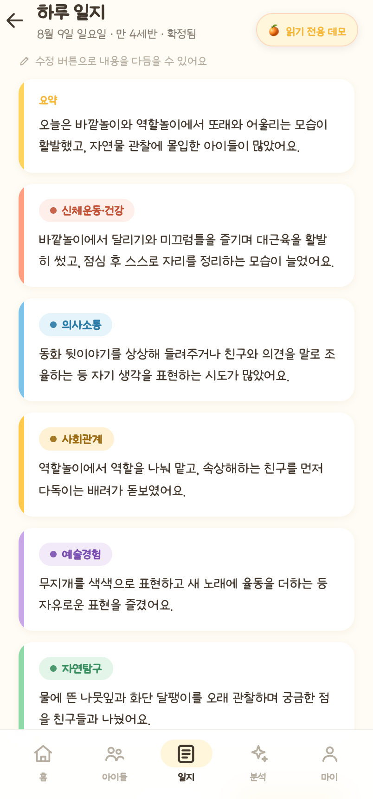
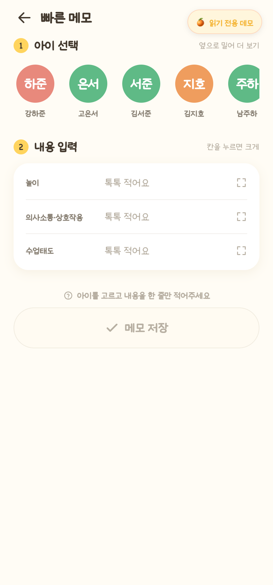
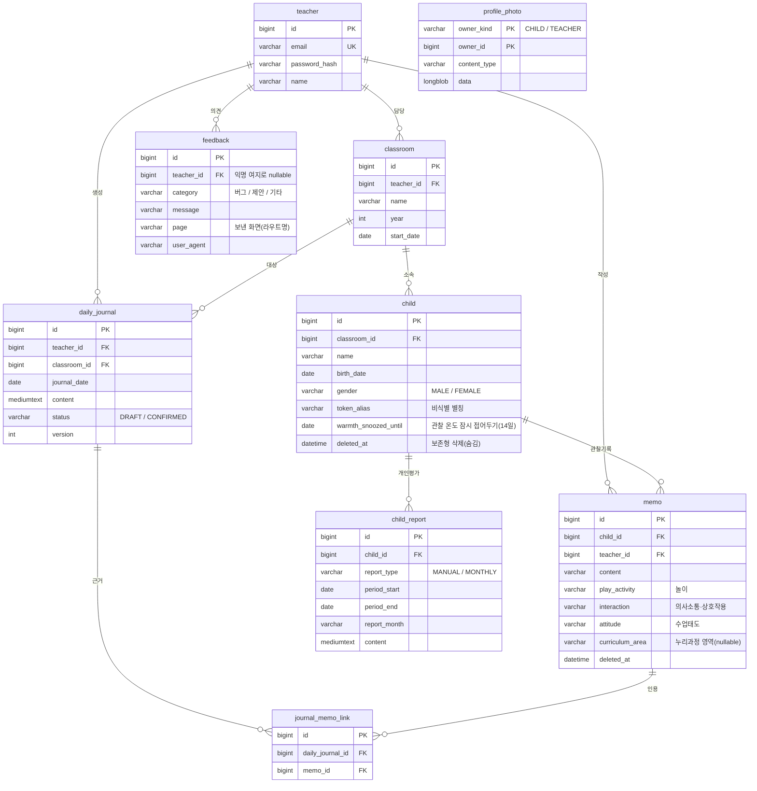

<div align="center">


### 선생님 곁에서 온전히 도움을 주는 기록관리 서비스

짧은 **메모** 한 줄이면 충분해요.<br>
아이별로 기록이 쌓이고, **AI**가 누리과정 기반 **하루 일지**와 **개인 관찰평가**를 대신 써 드립니다.

**▶ 라이브 · [teacherondo.co.kr](https://teacherondo.co.kr)** — 가입 없이 **읽기 전용 데모 계정**(`demo@ondo.app` / `ondo-demo`)으로 바로 둘러보세요.

</div>

---

## 🍊 온도가 뭐예요?

유치원·어린이집 교사는 하루 종일 아이들을 관찰하지만, 그 순간을 기록하고
누리과정에 맞춰 **일지·관찰평가로 정리하는 일**은 퇴근 후까지 이어지는 큰 부담입니다.

**온도**는 이 흐름을 이렇게 바꿉니다.

> **관찰한 순간에 10초 메모** → 아이별 타임라인에 자동 정리
> → 하루가 끝나면 **AI가 일지·평가 초안**을 작성 → 교사는 **검토·확정만**.

기록의 부담은 줄이고 아이를 바라보는 시간은 늘리는 것 — 그게 온도가 지향하는 따뜻한 온도입니다.

## ✨ 이런 걸 할 수 있어요

- **빠른 메모** — 아이 고르고 한 줄. 놀이·상호작용·태도를 10초 만에 기록.
- **아이별 타임라인** — 메모가 아이마다 쌓이고, 누리과정 5영역으로 분류·필터·수정.
- **관찰 온도** — 최근 2주 기록이 쌓인 아이는 따뜻하게, 옅어진 아이는 조용히 알려줘요. 결석한 아이는 **잠시 접어두기**.
- **AI 하루 일지** — 오늘 메모를 모아 누리과정 5영역 일지 초안을 자동 생성 → 검토·수정·확정·재분석.
- **개인 관찰평가** — 아이별 기록을 모아 상담·발달평가용 평가서를 작성(교사 수동 생성. 월말 자동 스케줄러는 env로 켜는 opt-in).
- **반·아이 관리** — 담당 반 선택·추가, 아이 등록·수정·숨김/복원, 프로필 사진(브라우저 1:1 크롭).
- **로그인** — 이메일 회원가입 · **카카오 로그인** · 비밀번호 재설정(이메일 링크) · 로그인 상태 유지.
- **어디서나** — 데스크톱·모바일 반응형 + **홈 화면 설치(PWA)**. 교실에선 폰으로 기록하고, 정리는 PC로.
- **도움말·피드백** — 자주 묻는 질문 페이지(`/help`)와, 화면 어디서든 열리는 **인앱 피드백** 창구(기록 + 메일 알림).

> 🔒 AI에 보낼 때 아이 실명은 **비식별화**되고 분석 후 복원됩니다. 원본 기록은 그대로 안전하게 보존돼요.

## 🌡️ 관찰 온도 — 죄책감이 아니라 인지

교사는 하루 종일 아이들을 관찰하지만, "내가 최근 누구를 많이 봤고 누구를 못 봤는지"까지 세고 있기는 어렵습니다. 관찰이 한쪽으로 기울어도 알아채는 시점이 늦고, 기록이 적은 아이는 월말 관찰평가에서 AI가 쓸 재료가 없어 결과물이 부실해집니다.

**관찰 온도**는 최근 2주 메모를 아이별로 모아, 요즘 자주 본 아이와 그렇지 못한 아이를 조용히 보여줍니다. 서비스 이름이 '온도'인 이유이기도 합니다.

이 기능은 **교사가 자기 성적표로 읽는 순간 실패합니다.** 그래서 이렇게 만들었어요.

- **숫자를 보여주지 않아요.** 점수도 건수도 없습니다. 숫자가 보이면 아이들끼리 등수가 되니까요.
- **"옅은" 아이는 최대 3명까지만.** 절반을 갈라 세우면 그건 정보가 아니라 "내가 방치한 명단"이 됩니다.
- **고르게 기록한 날은 아무도 표시되지 않아요.** 그게 정상입니다.
- **기록이 아직 적은 시기에는 기능 자체가 보이지 않아요.** 가입 직후 전원이 옅게 뜨면 그건 질책이니까요.
- **경고색을 쓰지 않아요.** 진한 노랑과 옅은 노랑, 농도 차이만 있습니다.
- **"못 보셨어요"가 아니라 "이번 주엔 한번 볼까요?"** — 지난 일을 탓하지 않고 다음 행동을 권합니다.
- **결석한 아이는 잠시 접어둘 수 있어요.** 볼 기회가 없었는데 옅게 뜨면 억울하니까요. 2주 뒤 자동으로 돌아옵니다 — 접어두고 잊으면 그 아이가 영영 안 보이게 되거든요.

## 📱 실행 화면

> 아래는 모두 **읽기 전용 데모 계정**으로 로그인한 실제 화면이에요 — [라이브에서 바로 둘러보기](https://teacherondo.co.kr) · `demo@ondo.app` / `ondo-demo`

**데스크톱 (사이드바 레이아웃)**

| 홈 | AI 하루 일지 | 아이 타임라인 | 아이 목록 |
|:---:|:---:|:---:|:---:|
|  |  |  |  |

**모바일 (하단 탭 레이아웃)**

| 홈 | 아이 타임라인 | AI 하루 일지 | 빠른 메모 |
|:---:|:---:|:---:|:---:|
|  |  |  |  |

## ⚙️ 기술 스택

| 영역 | 선택 |
|------|------|
| 백엔드 | Java 25 · Spring Boot 4 · Gradle · Spring Data JPA · Flyway |
| DB | MySQL 8.4 |
| 인증 | Spring Security(stateless) · JWT · BCrypt · **카카오 OAuth** · 비밀번호 재설정(SMTP 메일) |
| AI | OpenAI Chat Completions · structured outputs(strict) · 기본 모델 `gpt-5.4-nano` |
| 프론트 | Vue 3(Composition API) · Vue Router · Vite · 반응형(사이드바 ↔ 하단탭) · PWA(홈 화면 설치) |
| 인프라 | Docker · docker-compose · nginx(정적 서빙·gzip) |
| 배포 | GCP Cloud Run(API) · Cloud SQL for MySQL · Firebase Hosting(프론트·`/api` 리라이트) |
| 관측·지표 | Sentry(5xx 에러 · 기본 비활성, DSN 주입 시 활성) · 인앱 피드백 · 리텐션 SQL([`analytics/`](analytics/retention.sql)) |
| 테스트·측정 | JUnit 5 · Testcontainers(MySQL) · 성능 벤치 하네스([`bench/`](bench/)) |

## 🚀 빠르게 실행

Docker 하나면 백엔드 + DB가 함께 뜹니다.

```bash
docker compose up -d --build        # app + mysql 기동 (Flyway 스키마 자동 적용)
curl localhost:8090/actuator/health # {"status":"UP"}
```

- **바로 둘러보기(dev)**: 시드 계정 `teacher@ondo.dev` / `password1234` 로 로그인하면 만 4세반·아이 23명이 준비돼 있어요. (prod 프로파일은 시드 없이 회원가입으로 시작)
- **읽기 전용 데모**: `DEMO_ENABLED=true` 면 `demo@ondo.app` / `ondo-demo` 계정과 시연 데이터(반·아이 23명·메모·AI 일지·관찰평가)가 멱등 주입되고, 이 계정의 변경 요청은 서버가 차단(`DEMO_READ_ONLY`)해요 — 라이브 데모가 그대로 보존됩니다.
- 프론트 개발 서버: `cd frontend && npm install && npm run dev` → http://localhost:5273 (`/api` 는 :8090 으로 프록시)
- 창 폭 **900px** 기준으로 데스크톱/모바일 레이아웃이 자동 전환됩니다.

<details>
<summary>프로파일(dev / prod) — 시드·로깅 차이와 전환</summary>

`SPRING_PROFILES_ACTIVE` 로 실행 프로파일을 정합니다. compose 기본값은 `dev` 지만, **루트 `.env` 에 `SPRING_PROFILES_ACTIVE` 가 있으면 그 값이 우선**합니다(`.env.example` 은 배포 데모 기준이라 `prod`).

| | `dev` | `prod` |
|---|---|---|
| 시드 데이터 | ✅ `teacher@ondo.dev` / `password1234` + 만 4세반·아이 23명 자동 주입 | ❌ 없음 — 회원가입으로 시작 |
| 로깅 | `show_sql=true` · `com.ondo=DEBUG` | `show_sql=false` · `com.ondo=INFO` |
| Actuator | 상세 노출 | `health` 만(운영 정보 최소 노출) |

```bash
# dev 로 기동 (23명 시드 데모) — .env 를 안 건드리고 실행 시점에만 override
SPRING_PROFILES_ACTIVE=dev docker compose up -d --force-recreate app

# prod 로 기동 (시드 없이 회원가입 흐름)
SPRING_PROFILES_ACTIVE=prod docker compose up -d --force-recreate app
```

- 셸 환경변수(`SPRING_PROFILES_ACTIVE=…`)는 `.env` 값보다 우선하므로, 파일 수정 없이 한 번만 다른 프로파일로 띄울 수 있어요.
- **시드는 멱등**입니다. 반이 이미 있으면 다시 주입하지 않아요. 시드를 새로 넣으려면 DB 볼륨을 비우고 재기동합니다:
  ```bash
  docker compose down -v && SPRING_PROFILES_ACTIVE=dev docker compose up -d --build
  ```

</details>

<details>
<summary>백엔드 단독 실행 · 환경변수</summary>

```bash
cd backend
cp .env.example .env     # 시크릿 채우기 (.env 는 커밋 금지)
./gradlew bootRun        # MySQL 필요 → http://localhost:8090
```

- 기동에 MySQL 필요(Flyway 마이그레이션 적용, `ddl-auto=validate`).
- AI 호출은 `AI_API_KEY`(OpenAI)가 있어야 동작 — 미설정 시 일반 화면은 정상, AI 일지·평가 생성만 실패.
- 포트: 백엔드 **8090**, 프론트 dev **5273**. 하루 경계는 **KST(Asia/Seoul)** 기준.

</details>

## ☁️ 배포

**라이브: [teacherondo.co.kr](https://teacherondo.co.kr)** (GCP 서울 리전 `asia-northeast3` · Firebase Hosting 커스텀 도메인)

| 구성 | 서비스 |
|------|--------|
| 프론트(SPA) | **Firebase Hosting** — 정적 서빙 + `/api/**` → Cloud Run 리라이트 |
| API | **Cloud Run** — 컨테이너 오토스케일(0→N), 시크릿은 런타임 env 주입 |
| DB | **Cloud SQL for MySQL** — Cloud SQL 커넥터로 접속(프라이빗) |
| 스키마 | Flyway 마이그레이션 자동 적용(`ddl-auto=validate`) |

같은 컨테이너 이미지를 로컬(docker-compose)·클라우드(Cloud Run)에서 그대로 돌립니다. 실배포 절차는 런북 참고 — [GCP Cloud Run](docs/deploy-gcp-cloudrun-runbook.md) · [AWS(RDS+caddy)](docs/deploy-aws-runbook.md).

## 🛡️ 실사용자를 받기 위해 붙인 것들

배포로 끝나지 않아서, 실제 선생님이 쓰기 시작해도 버틸 수 있게 붙인 장치들입니다. **새 인프라는 거의 늘리지 않는 방향**으로 골랐어요.

| | 무엇 | 어떻게 |
|---|---|---|
| **법적 고지** | 개인정보 처리방침 · 이용약관 | `/privacy` · `/terms` (로그인 전 접근 가능) + 가입 시 **필수 동의** |
| **에러 모니터링** | Sentry | 5xx만 수동 캡처(PII 미전송). `SENTRY_DSN` 이 비면 **완전 무동작** — dev·테스트에 영향 없음 |
| **사용자 의견** | 인앱 피드백 | 화면 어디서나 열리는 위젯 → `feedback` 테이블 적재 + `FEEDBACK_TO` 로 메일 알림(데모 계정은 예외 허용) |
| **지표** | 리텐션·활성화 | 새 로그 인프라 없이 **기존 스키마에 SQL만** — [`analytics/retention.sql`](analytics/retention.sql) (데모 계정 제외, KST 기준) |
| **설치** | PWA | `manifest.webmanifest` + 아이콘 — 교사가 폰 홈 화면에 바로 얹어 쓸 수 있게 |
| **첫인상** | 소개 페이지 | 로그아웃 상태로 루트에 들어오면 로그인 벽 대신 `/intro` 로 |
| **성능** | 벤치 하네스 | 개선을 숫자로 남기기 위한 시드 + 측정 도구 — [`bench/`](bench/) (결과는 아래 절에) |

## 🔧 만난 문제와 고친 방법

### 성능 — 재고, 고치고, 다시 쟀습니다

dev 시드는 메모 8건이라 어떤 개선도 "0ms → 0ms"로 측정됩니다. 그래서 1학기치 데이터(메모 3,000여 건 · 아이 23명 · 사진 5MB대 · 일지 113건)를 결정적으로 주입하는 [`bench/`](bench/) 하네스를 먼저 만들고, 같은 조건에서 개선 전후를 쟀습니다.

| 문제 | 지표 | before → after |
|---|---|---|
| **아이 명단이 사진 원본까지 읽음** | DB→앱 전송/요청 | 5,425.7KB → **4.2KB** (−99.9%) |
| | p95 응답시간 | 19.7ms → **8.4ms** (−57.4%) |
| **아바타 재검증이 304를 주면서도 사진을 읽음** | 재검증 DB 읽기/요청 | 325.0KB → **1.5KB** (−99.5%) |
| **정적 자산·API 응답 무압축** | 초기 로딩 전송량 | 282.9KB → **79.6KB** (−71.9%) |
| | 일지 목록 응답 | 57.7KB → **2.4KB** (−95.8%) |

- **아이 명단** — 아바타 갱신시각만 필요한 자리에서 리포지토리가 엔티티를 반환해 `@Lob` LONGBLOB까지 함께 읽고 있었습니다. 기본 속성이라 지연 로딩이 걸리지 않습니다. 응답 0.6KB를 만들자고 MySQL에서 5.4MB를 끌어온 셈이라, 갱신시각 전용 projection으로 select 절을 두 컬럼에 고정했습니다.
- **ETag 재검증** — 엔티티를 먼저 통째로 읽은 뒤 그 ETag로 304를 만들던 구조였습니다. 본문은 안 보내면서 DB는 매번 사진을 읽었죠. 갱신시각만 먼저 읽고 `checkNotModified`로 끊은 뒤, 실제로 바뀐 경우에만 바이트를 가져옵니다. 대신 캐시 미스 경로는 조회가 1건 늘어납니다(p50 +0.9ms) — 재검증이 훨씬 잦으므로 남는 거래입니다.
- **압축** — nginx gzip 활성화. 사진 응답(JPEG)만 변화 없는 것이 정상 동작의 증거입니다.

> 앞의 두 건은 **읽은 행 수와 응답 크기는 그대로인데 전송 바이트만 사라졌습니다.** 쿼리 결과를 바꾼 게 아니라 불필요하게 딸려오던 사진 원본만 없앴다는 직접 증거입니다. (측정 시점이 달라 데이터셋 스냅샷이 조금씩 다릅니다 — 비교는 항상 같은 스냅샷 안에서만 했습니다.)

<details>
<summary>트러블슈팅 — 실제로 터진 것들</summary>

**실제 AI를 붙이고서야 드러난 것** (테스트로는 안 잡혔습니다)

| 증상 | 원인 | 대응 |
|---|---|---|
| AI 호출이 400으로 거절 | 신형 모델이 `max_tokens`를 거부 | `max_completion_tokens`로 전환 |
| 비식별화 복원 500 | 모델이 매핑에 없는 `[[CHILD_n]]`을 **환각 생성** | 형식이 맞는 미매핑 토큰은 중립어로 치환, 형식이 깨진 것만 차단 + 프롬프트로 억제 |
| 자정~오전 9시에 '오늘'이 어긋남 | 프론트는 브라우저 KST, 백엔드는 UTC | `AppTime`(Asia/Seoul) 단일 출처로 통일 |

**코드를 쓰기 전에 잡은 것** — 아키텍처를 다관점 리뷰로 두들겨 16건을 구현 전에 수습했습니다.

- 동기 AI 호출 15초가 프록시 타임아웃에 잘려 에러 핸들러가 무력화 → 서버 하드 타임아웃을 프록시보다 짧게
- 비식별화 복원이 한국어 조사에서 깨짐(`아이A` + `가`) → 센티넬 토큰 `[[CHILD_1]]` 형식으로
- Spring self-invocation 탓에 `REQUIRES_NEW` 트랜잭션 분리가 무효 → 별도 빈으로 분리
- 일지 soft delete와 `UNIQUE(teacher, classroom, date)` 충돌 → 일지는 재생성 산출물이므로 UPDATE 덮어쓰기로 (충돌 원천 제거)
- 월말 스케줄러 멱등성 부재 → `UNIQUE(child_id, report_month)` + 아이 1명 단위 트랜잭션 격리

**반복된 패턴** (에픽 회고에서)

- 가장 어려운 결함은 전부 **"두 시점 사이의 상태 변화"**였습니다 — 락 오해제, 분석 중 메모 삭제, `analyzedAt` 스냅샷, KST/UTC 갭. 대응은 결정적 테스트(래치 기반 경합, ±10초 시드로 wall-clock 비의존).
- 입력 검증·경계는 매번 리뷰가 잡아줬습니다. 안전망은 작동했지만 같은 그물에 반복해 걸린 건 개선 신호로 남겼습니다.

> 위 내용은 저장소에 커밋하지 않는 작업 문서(리뷰·트러블슈팅 로그 · 미해결/이연 목록 · 에픽 회고)에서 추린 것입니다.
> 미룬 일은 "지금 안 함 / 어느 스토리에서 함"을 출처(파일:라인)까지 적어 두는 것을 규칙으로 삼았고, 실제로 그렇게 미룬 항목들이 나중 스토리에서 해결됐습니다.

</details>

## 📚 더 알아보기

- **기획 산출물** — [`docs/portfolio/`](docs/portfolio/) : 사용자 인터뷰 · As-Is/To-Be · User Flow & IA · 지표 설계
- **구현 명세** — [`docs/specs/`](docs/specs/) : API · 데이터 모델 · 에러 코드 · AI 연동
- **배포 런북** — [`docs/deploy-gcp-cloudrun-runbook.md`](docs/deploy-gcp-cloudrun-runbook.md) · [`docs/deploy-aws-runbook.md`](docs/deploy-aws-runbook.md)
- **지표 쿼리** — [`analytics/retention.sql`](analytics/retention.sql) : 가입→활성화 · N일 리텐션 · 주간 활성 교사
- **성능 측정** — [`bench/`](bench/) : 1학기치 시드 + before/after 비교 하네스(`bench/README.md`)

<details>
<summary>저장소 구조</summary>

```
ondo/
├── backend/     # Spring Boot + Java REST API
│   └── src/main/java/com/ondo/
│       ├── auth/       # 회원가입 · 로그인 · JWT · 비밀번호 재설정 · kakao(OAuth)
│       ├── classroom/  # 담당 반 · 새 반 생성
│       ├── child/      # 아이 등록·수정 · 보존형 삭제(숨김)·복원
│       ├── memo/       # 메모 기록 · 타임라인 · 누리과정 영역
│       ├── warmth/     # 관찰 온도(최근 2주 관찰 농도 · 잠시 접어두기)
│       ├── journal/    # AI 하루 일지(생성·검토·확정·재분석)
│       ├── report/     # 개인 관찰평가(수동 생성 + 월말 자동 스케줄러 · 기본 비활성, env로 opt-in)
│       ├── photo/      # 프로필 이미지(아이·교사)
│       ├── feedback/   # 인앱 피드백 수집(DB 적재 + 메일 알림)
│       ├── ai/         # AiClient 추상화 · 비식별화 · 프롬프트/검증
│       ├── mail/       # 메일 발송 추상화(SMTP · 미설정 시 로깅 폴백)
│       ├── config/     # Security · Ai · Kakao · Mail · Sentry · Demo · Scheduling
│       └── common/     # 공통 에러·응답·시간(KST)·동시성 가드
├── frontend/    # Vue 3 + Vite SPA (데스크톱/모바일 반응형 · PWA)
├── analytics/   # 리텐션·활성화 지표 SQL
├── bench/       # 성능 측정 시드 + before/after 하네스
└── docs/        # 기획 산출물 · 구현 명세 · 배포 런북
```

</details>

<details>
<summary>데이터 모델 (ERD)</summary>

Flyway 마이그레이션(`backend/src/main/resources/db/migration`)이 스키마 정본. 상세: [`docs/specs/data-model-spec.md`](docs/specs/data-model-spec.md).


```mermaid
erDiagram
    teacher ||--o{ classroom : "담당"
    teacher ||--o{ memo : "작성"
    teacher ||--o{ daily_journal : "생성"
    classroom ||--o{ child : "소속"
    classroom ||--o{ daily_journal : "대상"
    child ||--o{ memo : "관찰기록"
    child ||--o{ child_report : "개인평가"
    daily_journal ||--o{ journal_memo_link : "근거"
    memo ||--o{ journal_memo_link : "인용"
    teacher ||--o{ feedback : "의견"

    teacher {
        bigint id PK
        varchar email UK
        varchar password_hash
        varchar name
    }
    classroom {
        bigint id PK
        bigint teacher_id FK
        varchar name
        int year
        date start_date
    }
    child {
        bigint id PK
        bigint classroom_id FK
        varchar name
        date birth_date
        varchar gender "MALE / FEMALE"
        varchar token_alias "비식별 별칭"
        date warmth_snoozed_until "관찰 온도 잠시 접어두기(14일)"
        datetime deleted_at "보존형 삭제(숨김)"
    }
    memo {
        bigint id PK
        bigint child_id FK
        bigint teacher_id FK
        varchar content
        varchar play_activity "놀이"
        varchar interaction "의사소통·상호작용"
        varchar attitude "수업태도"
        varchar curriculum_area "누리과정 영역(nullable)"
        datetime deleted_at
    }
    daily_journal {
        bigint id PK
        bigint teacher_id FK
        bigint classroom_id FK
        date journal_date
        mediumtext content
        varchar status "DRAFT / CONFIRMED"
        int version
    }
    journal_memo_link {
        bigint id PK
        bigint daily_journal_id FK
        bigint memo_id FK
    }
    child_report {
        bigint id PK
        bigint child_id FK
        varchar report_type "MANUAL / MONTHLY"
        date period_start
        date period_end
        varchar report_month
        mediumtext content
    }
    profile_photo {
        varchar owner_kind PK "CHILD / TEACHER"
        bigint owner_id PK
        varchar content_type
        longblob data
    }
    feedback {
        bigint id PK
        bigint teacher_id FK "익명 여지로 nullable"
        varchar category "버그 / 제안 / 기타"
        varchar message
        varchar page "보낸 화면(라우트명)"
        varchar user_agent
    }
```

</details>

## 📌 현재 상태

| 단계 | 내용 | 상태 |
|------|------|------|
| Epic 1 | 골격 · 인증(JWT) · 반 선택 · 아이 등록·관리 | ✅ 완료 |
| Epic 1+ | 회원가입 · 카카오 로그인 · 비밀번호 재설정 · 새 반 추가 · 아이 숨김/복원 · 프로필 사진 | ✅ 완료 |
| Epic 2 | 메모 기록 · 타임라인 · 누리과정 영역 분류 · 관찰 온도 | ✅ 완료 |
| Epic 3 | AI 하루 일지 (비식별화 → 분석 → 검증 · 재분석) | ✅ 완료 |
| Epic 4 | 개인 관찰평가 (수동 생성 + 월말 자동 스케줄러 · env로 opt-in) | ✅ 완료 |
| Epic 5 | 실배포 — Cloud Run · Cloud SQL · Firebase Hosting ([라이브](https://teacherondo.co.kr)) | ✅ 완료 |
| 운영 준비 | 처리방침·약관·가입 동의 · Sentry · 인앱 피드백 · 리텐션 SQL · PWA · 소개/도움말 페이지 | ✅ 완료 |

전체 **208개 테스트 통과**(JUnit 5 · Testcontainers — 통합테스트 15개 클래스 + 단위테스트 10개). AI 일지·개인평가는 실제 OpenAI(`gpt-5.4-nano`)로 end-to-end 검증됐고, 비밀번호 재설정 메일·카카오 로그인·읽기 전용 데모도 라이브에서 동작 확인됨.
