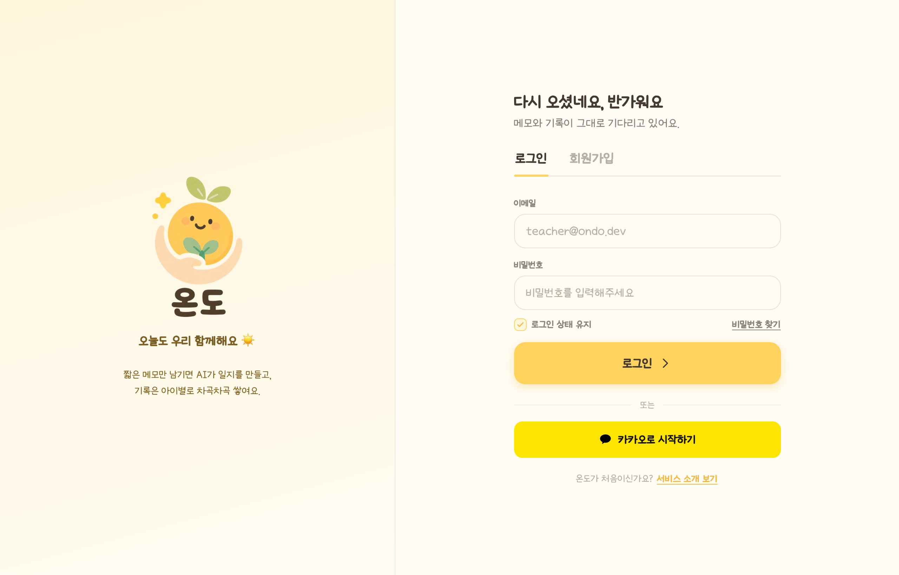
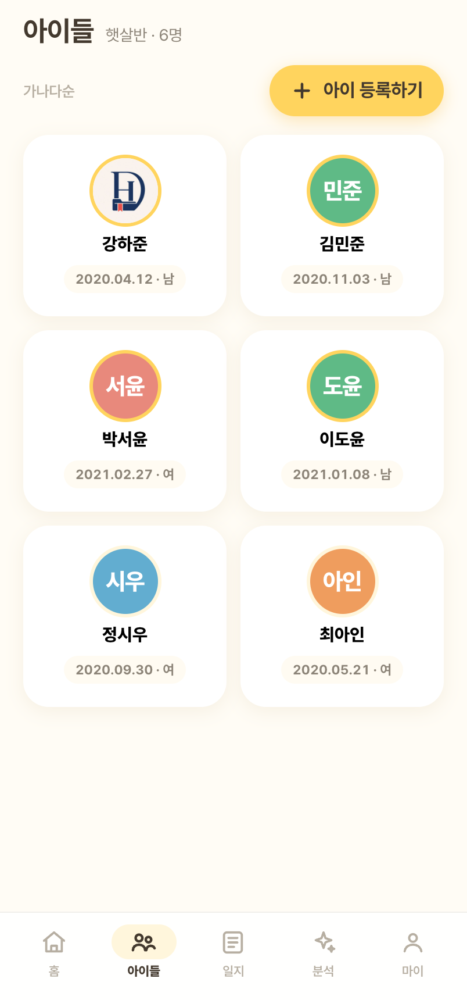
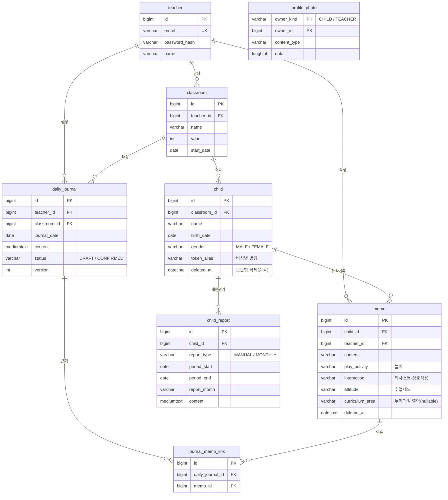

<div align="center">


### 선생님 곁에서 온전히 도움을 주는 기록관리 서비스

짧은 **메모** 한 줄이면 충분해요.<br>
아이별로 기록이 쌓이고, **AI**가 누리과정 기반 **하루 일지**와 **개인 관찰평가**를 대신 써 드립니다.

</div>

---

## 🍊 온도가 뭐예요?

유치원·어린이집 교사는 하루 종일 아이들을 관찰하지만, 그 순간을 기록하고
누리과정에 맞춰 **일지·관찰평가로 정리하는 일**은 퇴근 후까지 이어지는 큰 부담입니다.

**온도**는 이 흐름을 이렇게 바꿉니다.

> **관찰한 순간에 10초 메모** → 아이별 타임라인에 자동 정리
> → 하루가 끝나면 **AI가 일지·평가 초안**을 작성 → 교사는 **검토·확정만**.

기록의 부담은 줄이고 아이를 바라보는 시간은 늘리는 것 — 그게 온도가 지향하는 따뜻한 온도입니다.

## ✨ 이런 걸 할 수 있어요

- **빠른 메모** — 아이 고르고 한 줄. 놀이·상호작용·태도를 10초 만에 기록.
- **아이별 타임라인** — 메모가 아이마다 쌓이고, 누리과정 5영역으로 분류·필터·수정.
- **AI 하루 일지** — 오늘 메모를 모아 누리과정 5영역 일지 초안을 자동 생성 → 검토·수정·확정·재분석.
- **개인 관찰평가** — 아이별 기록을 모아 상담·발달평가용 평가서를 작성(월말 자동 생성 포함).
- **반·아이 관리** — 담당 반 선택·추가, 아이 등록·수정·숨김/복원, 프로필 사진(브라우저 1:1 크롭).
- **어디서나** — 데스크톱·모바일 반응형. 교실에선 폰으로 기록하고, 정리는 PC로.

> 🔒 AI에 보낼 때 아이 실명은 **비식별화**되고 분석 후 복원됩니다. 원본 기록은 그대로 안전하게 보존돼요.

## 📱 실행 화면

**데스크톱 (사이드바 레이아웃)**

| 로그인 | 홈 | 아이 목록 | 아이 타임라인 |
|:---:|:---:|:---:|:---:|
|  |  |  |  |

**모바일 (하단 탭 레이아웃)**

| 홈 | 아이 목록 | 빠른 메모 | 아이 타임라인 |
|:---:|:---:|:---:|:---:|
|  |  |  |  |

## ⚙️ 기술 스택

| 영역 | 선택 |
|------|------|
| 백엔드 | Java 25 · Spring Boot 4 · Gradle · Spring Data JPA · Flyway |
| DB | MySQL 8.4 |
| 인증 | Spring Security(stateless) · JWT · BCrypt |
| AI | OpenAI Chat Completions · structured outputs(strict) · 기본 모델 `gpt-5.4-mini` |
| 프론트 | Vue 3(Composition API) · Vite · 반응형(사이드바 ↔ 하단탭) |
| 인프라 | Docker · docker-compose · 프로덕션 nginx 정적 서빙 |
| 테스트 | JUnit 5 · Testcontainers(MySQL) |

## 🚀 빠르게 실행

Docker 하나면 백엔드 + DB가 함께 뜹니다.

```bash
docker compose up -d --build        # app + mysql 기동 (Flyway 스키마 자동 적용)
curl localhost:8090/actuator/health # {"status":"UP"}
```

- **바로 둘러보기(dev)**: 시드 계정 `teacher@ondo.dev` / `password1234` 로 로그인하면 햇살반·아이 6명이 준비돼 있어요. (prod 프로파일은 시드 없이 회원가입으로 시작)
- 프론트 개발 서버: `cd frontend && npm install && npm run dev` → http://localhost:5273 (`/api` 는 :8090 으로 프록시)
- 창 폭 **900px** 기준으로 데스크톱/모바일 레이아웃이 자동 전환됩니다.

<details>
<summary>백엔드 단독 실행 · 환경변수</summary>

```bash
cd backend
cp .env.example .env     # 시크릿 채우기 (.env 는 커밋 금지)
./gradlew bootRun        # MySQL 필요 → http://localhost:8090
```

- 기동에 MySQL 필요(Flyway 마이그레이션 적용, `ddl-auto=validate`).
- AI 호출은 `AI_API_KEY`(OpenAI)가 있어야 동작 — 미설정 시 일반 화면은 정상, AI 일지·평가 생성만 실패.
- 포트: 백엔드 **8090**, 프론트 dev **5273**. 하루 경계는 **KST(Asia/Seoul)** 기준.

</details>

## 📚 더 알아보기

- **기획 산출물** — [`docs/portfolio/`](docs/portfolio/) : 사용자 인터뷰 · As-Is/To-Be · User Flow & IA · 지표 설계
- **구현 명세** — [`docs/specs/`](docs/specs/) : API · 데이터 모델 · 에러 코드 · AI 연동

<details>
<summary>저장소 구조</summary>

```
ondo/
├── backend/     # Spring Boot + Java REST API
│   └── src/main/java/com/ondo/
│       ├── auth/       # 회원가입 · 로그인 · JWT
│       ├── classroom/  # 담당 반 · 새 반 생성
│       ├── child/      # 아이 등록·수정 · 보존형 삭제(숨김)·복원
│       ├── memo/       # 메모 기록 · 타임라인 · 누리과정 영역
│       ├── journal/    # AI 하루 일지(생성·검토·확정·재분석)
│       ├── report/     # 개인 관찰평가(수동 + 월말 자동 스케줄러)
│       ├── photo/      # 프로필 이미지(아이·교사)
│       ├── ai/         # AiClient 추상화 · 비식별화 · 프롬프트/검증
│       └── common/     # 공통 에러·시간(KST)·동시성 가드
├── frontend/    # Vue 3 + Vite SPA (데스크톱/모바일 반응형)
└── docs/        # 기획 산출물 · 구현 명세
```

</details>

<details>
<summary>데이터 모델 (ERD)</summary>

Flyway 마이그레이션(`backend/src/main/resources/db/migration`)이 스키마 정본. 상세: [`docs/specs/data-model-spec.md`](docs/specs/data-model-spec.md).


```mermaid
erDiagram
    teacher ||--o{ classroom : "담당"
    teacher ||--o{ memo : "작성"
    teacher ||--o{ daily_journal : "생성"
    classroom ||--o{ child : "소속"
    classroom ||--o{ daily_journal : "대상"
    child ||--o{ memo : "관찰기록"
    child ||--o{ child_report : "개인평가"
    daily_journal ||--o{ journal_memo_link : "근거"
    memo ||--o{ journal_memo_link : "인용"

    teacher {
        bigint id PK
        varchar email UK
        varchar password_hash
        varchar name
    }
    classroom {
        bigint id PK
        bigint teacher_id FK
        varchar name
        int year
        date start_date
    }
    child {
        bigint id PK
        bigint classroom_id FK
        varchar name
        date birth_date
        varchar gender "MALE / FEMALE"
        varchar token_alias "비식별 별칭"
        datetime deleted_at "보존형 삭제(숨김)"
    }
    memo {
        bigint id PK
        bigint child_id FK
        bigint teacher_id FK
        varchar content
        varchar play_activity "놀이"
        varchar interaction "의사소통·상호작용"
        varchar attitude "수업태도"
        varchar curriculum_area "누리과정 영역(nullable)"
        datetime deleted_at
    }
    daily_journal {
        bigint id PK
        bigint teacher_id FK
        bigint classroom_id FK
        date journal_date
        mediumtext content
        varchar status "DRAFT / CONFIRMED"
        int version
    }
    journal_memo_link {
        bigint id PK
        bigint daily_journal_id FK
        bigint memo_id FK
    }
    child_report {
        bigint id PK
        bigint child_id FK
        varchar report_type "MANUAL / MONTHLY"
        date period_start
        date period_end
        varchar report_month
        mediumtext content
    }
    profile_photo {
        varchar owner_kind PK "CHILD / TEACHER"
        bigint owner_id PK
        varchar content_type
        longblob data
    }
```

</details>

## 📌 현재 상태

| 단계 | 내용 | 상태 |
|------|------|------|
| Epic 1 | 골격 · 인증(JWT) · 반 선택 · 아이 등록·관리 | ✅ 완료 |
| Epic 1+ | 회원가입 · 새 반 추가 · 아이 숨김/복원 · 프로필 사진 | ✅ 완료 |
| Epic 2 | 메모 기록 · 타임라인 · 누리과정 영역 분류 | ✅ 완료 |
| Epic 3 | AI 하루 일지 (비식별화 → 분석 → 검증 · 재분석) | ✅ 완료 |
| Epic 4 | 개인 관찰평가 (수동 + 월말 자동 스케줄러) | ✅ 완료 |
| Epic 5 | 실배포 (prod 프로파일 · nginx 정적 서빙 · `deploy.sh`) | 🔜 진행 중 |

전체 **130개 테스트 통과**(JUnit5 · Testcontainers). AI 일지·개인평가는 실제 OpenAI(`gpt-5.4-mini`)로 end-to-end 검증됨.
