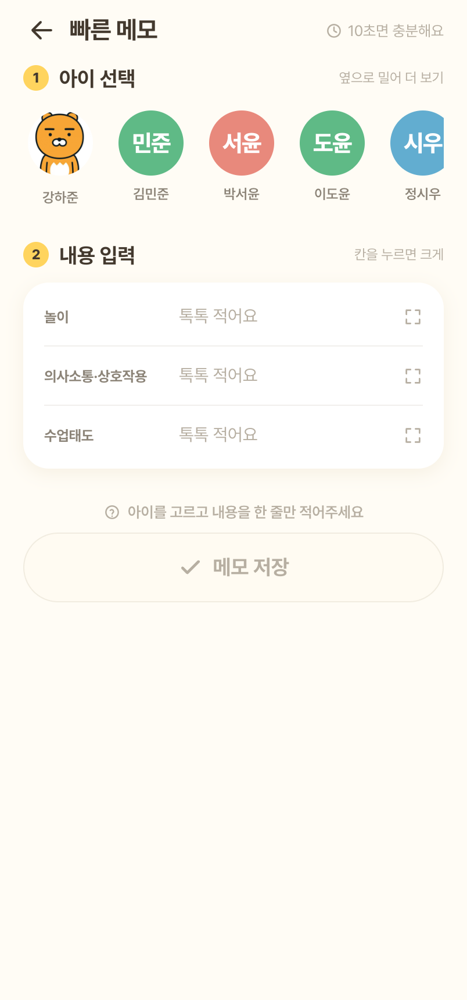
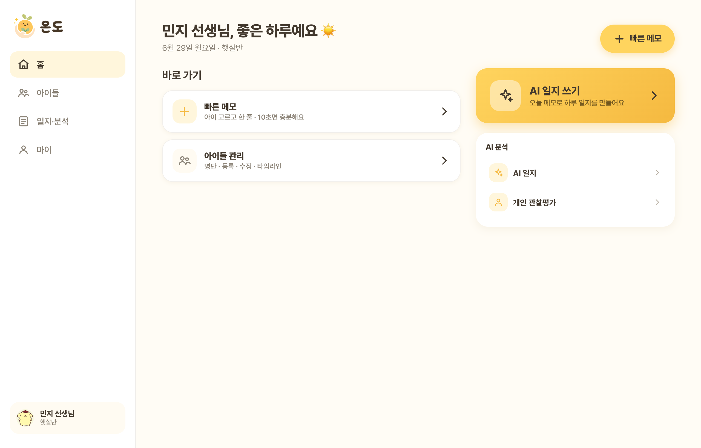
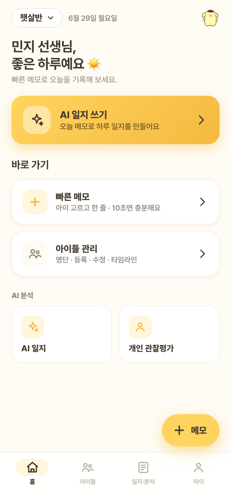
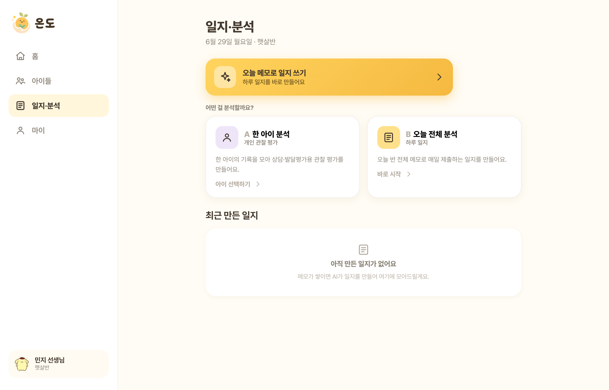

# PROJECT EXPERIENCE

> 문제 정의부터 사용자 흐름, 화면 설계까지 연결한 프로젝트 경험

---

## 1. 온도 (ONDO)

**AI 기반 유아 관찰 기록 및 일지 작성 보조 서비스**

개인 프로젝트 | 2026.06 | 기획 · 설계 · 구현
[GitHub Repository](https://github.com/dahyunhub/ondo)

> 대표 목업: **수업 중 빠른 메모 화면(모바일)** — 아이를 고르고 놀이·상호작용·수업태도를 한 줄씩 기록. "10초면 충분"한 입력으로 현장 인지부하를 최소화.

**메인 화면 — 데스크톱 / 모바일 두 레이아웃**

> 동일한 홈을 **데스크톱(좌측 사이드바)** 과 **모바일(하단 탭)** 두 레이아웃으로 제공. 빠른 메모·아이 관리 바로 가기와 AI 일지 진입을 한눈에 두어, 사무 환경과 교실 현장 양쪽 사용 맥락을 모두 지원.

**AI 일지·분석 화면**

> 일과 후 분석 진입 — **"오늘 전체 분석"(하루 일지)** 과 **"한 아이 분석"(개인 관찰평가)** 을 분리해, 교사가 목적에 맞게 선택해 실행. 생성된 일지는 검토·수정·확정·재분석할 수 있다.

---

## Problem · 문제 정의

교사는 유아별 관찰 기록을 일지와 관찰평가로 정리하는 과정에서 반복적인 확인과 문서 작성 부담을 겪는다.
수업 중에는 아이를 관찰할 시간이 부족하고, 일과 후에는 흩어진 기억에 의존해 누리과정 5개 영역에 맞춰 일지를 서술해야 한다. 매월 유아별 관찰평가까지 더해지면 부담은 누적된다.

## Target User · 대상 사용자

유치원 교사, 방과후 과정 교사

## User Flow · 유저 플로우

짧은 메모 등록 → 일과 후 AI 분석 → 누리과정 기반 일지 초안 생성 → 검토·확정 → 유아별 월간 기록 확인

## UI/UX Point · UI/UX 설계 포인트

교사가 **수업 중에는 빠르게 메모만 남기고**, **일과 후 필요한 시점에 AI 분석을 직접 실행**할 수 있도록 설계했다. 분석을 자동이 아닌 교사 주도로 둬, 기록의 맥락과 실행 시점을 교사가 통제하도록 했다.

## My Role · 담당 역할

교사 경험 기반 **문제 정의**, **사용자 시나리오 도출**, **화면 흐름 설계**, **기능 요구사항 정리**, **주요 기능 구현**

---

# 기획 관점 정리

> 기획자 포트폴리오 관점에서, 기능 구현보다 아래 흐름으로 정리한 버전.

### 문제 정의
- 수업 중 관찰을 즉시 기록하기 어렵고, 일과 후 흩어진 기억으로 일지·관찰평가를 작성하는 **반복적 문서 부담**.
- 누리과정 영역 분류와 서술까지 수작업 → 핵심 업무(아이 관찰)보다 문서 작업에 시간이 쏠림.

### 사용자 시나리오
- **(수업 중)** 블록놀이에 몰입한 아이를 보고 30초 만에 한 줄 메모를 남긴다.
- **(일과 후)** 하루치 메모를 모아 'AI 일지 생성'을 실행하면 누리과정 5개 영역 초안이 만들어진다. 교사는 검토·수정 후 확정한다.
- **(월말)** 유아별 관찰평가가 한 달 기록을 근거로 자동 생성되고, 교사는 확인·보정한다.

### 유저 플로우
메모 등록 → 일과 후 AI 분석 → 누리과정 기반 일지 초안 → 검토·확정 → 유아별 월간 기록 확인

### 화면 흐름 설계
로그인 · 회원가입 → 반 선택 → 홈(빠른 메모 · AI 진입) → 아이 목록 → 유아별 타임라인 → AI 일지 → 마이
→ 모든 화면을 **데스크톱(사이드바)·모바일(하단 탭) 두 레이아웃**으로 설계해, 사무실과 교실 현장 양쪽 사용 맥락을 모두 지원.

### 기능 요구사항 정리
- 관찰 메모 기록(놀이 · 상호작용 · 수업태도)과 유아별 타임라인 조회
- 누리과정 영역 자동 분류
- 하루치 메모 묶음 → AI 일지 초안 생성 · 검토 · 확정 · 재분석
- 유아별 관찰평가(수동 생성 + 월말 자동 생성)
- 회원가입 · 반/아이 관리 · 프로필 사진 등록

### UI/UX 설계
- **수업 중 인지부하 최소화**: 메모는 한 화면에서 즉시 입력, 영역 분류 같은 부가 정보는 나중에 자동 처리.
- **AI 실행 시점을 교사에게 위임**: 자동 분석이 아니라 교사가 원하는 시점에 명시적으로 실행.
- **현장/사무 두 맥락 대응**: 동일 기능을 모바일·데스크톱 두 레이아웃으로 일관 제공.

### 정보 구조 설계
- 교사 → 반 → 아이 → 메모(→ 누리과정 영역)
- 메모(N) ↔ 일지(반·일자 단위) : 일지는 어떤 메모를 근거로 생성됐는지 연결
- 아이 → 관찰평가(기간 단위)
→ "기록(메모)이 곧 분석(일지·평가)의 근거"가 되도록, 데이터 사이 연결을 중심으로 구조화.

### 사용 맥락 기반 의사결정
- **수업 중엔 메모만, 분류는 자동** → 현장에서의 인지부하·시간 제약 반영.
- **AI는 교사가 실행 시점 선택** → 분석 비용과 교사의 통제감·검토 책임을 함께 고려.
- **아이 삭제 대신 '숨김(보존형 삭제)'** → 학기 종료·전원 후에도 기록 보존이 필요한 교육 현장 특성 반영.
- **개인정보 비식별화 후 AI 전송** → 아동 실명·민감정보 보호를 분석 파이프라인에 내재화.

### 협업 및 구현 가능성 검토
- 기획 산출물(PRD)부터 아키텍처, 에픽·스토리 단위까지 **단계적으로 분해**하고, API·데이터 모델 명세를 정본으로 두어 설계와 구현의 정합성을 유지.
- 각 기능을 독립 스토리로 나눠 **구현 → 검증 → 회고** 사이클로 진행하며, 실제 동작(AI 연동 포함)까지 확인해 구현 가능성을 검증.

---

*기술 스택(참고): Spring Boot · Java 25 · MySQL · Vue 3 · OpenAI(구조화 출력) · Docker*
